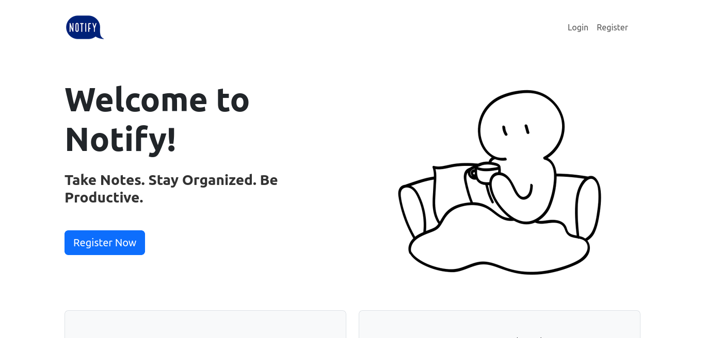
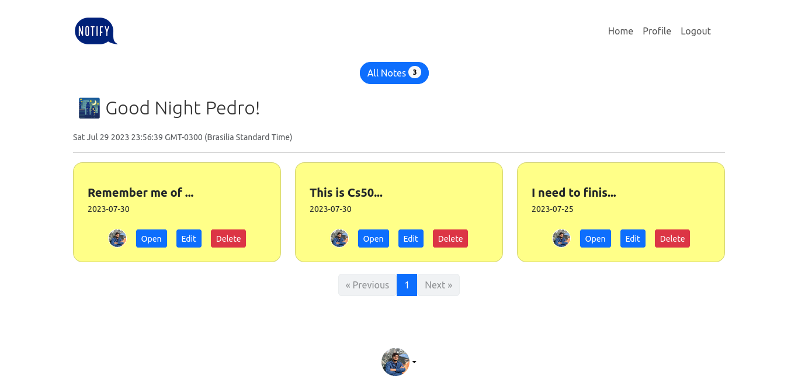
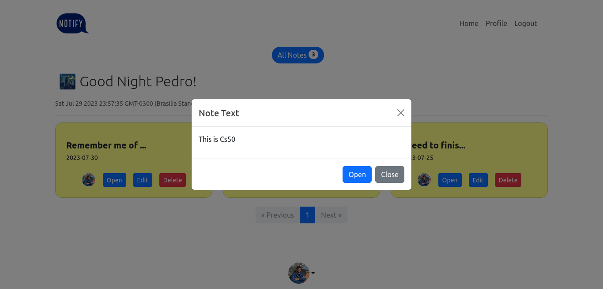
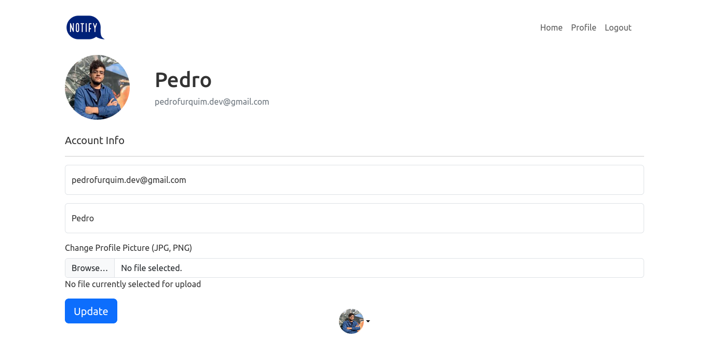

# Notify
#### Video Demo:  <https://www.youtube.com/watch?v=Evftrt2YWt4>
#### Description: Notify is a minimalist web-based CRUD application that allows users to create, read, update, and delete notes. It was fully developed by [@Pedro Furquim](https://github.com/devpedrofurquim) as his final project for Cs50.

You can check out the live version of the project here: [Notify Live](https://notify-mg43.onrender.com/)

## Features

Notify is designed to enhance the user experience and provide seamless functionality. Below are the key features included in the project:

* User Registration and Login:
    * Users can securely register accounts with Notify to access the application.
    * Existing users can log in with their credentials to manage their data.
* Password Reset Functionality:
    * Notify offers a secure password reset mechanism.
    * Users who forget their passwords can request a reset link sent to their registered email.
    * The reset link contains a token that allows users to reset their password securely.
* User Profile Management:
    * Users have the flexibility to update their profile information.
    * They can change their profile picture, username, and email address as needed.
* Note Management:
    * Notify enables users to create personal notes for organizing information.
    * Users can read and view their existing notes.
    * The application supports updating notes to keep information up to date.
    * Users have the option to delete notes they no longer need.

## Tech Stack

Notify utilizes tech stack Cs50 teaches their students. The technologies employed in the project include:

* **Client-Side:**
    * **HTML:** Hypertext Markup Language, the standard markup language for creating web pages and web applications.
    * **CSS:** Cascading Style Sheets, used for styling the HTML elements and enhancing the visual presentation.
    * **Bootstrap:** A popular front-end framework that provides pre-designed components and styles, making it easier to create responsive and visually appealing web applications.
    * **JavaScript:** A versatile programming language for adding interactivity and dynamic elements to the web pages.

* **Server-Side:**
    * **Python:** The programming language used for the backend logic and server-side processing.
    * **Flask:** A lightweight and flexible Python web framework that simplifies the development of web applications by providing essential tools and libraries.

* **Database:**
    * **PostgreSQL:** A powerful open-source relational database management system. It is chosen for its reliability, scalability, and strong data integrity features.

#Project Structure

The Notify project follows the conventions of the Flask Framework. Below is an overview of the project's structure:
`
` 
├── project
│   ├── app.py
│   ├── requirements.txt
│   ├── website
│   │   ├── templates
│   │   │   ├── errors
│   │   │   │   ├── 404.html
│   │   │   │   ├── 405.html
│   │   │   │   ├── 500.html
│   │   │   ├── articles.html
│   │   │   ├── foo.html
│   │   │   ├── home.html
│   │   │   ├── index.html
│   │   │   ├── login.html
│   │   │   ├── note.html
│   │   │   ├── profile.html
│   │   │   ├── register.html
│   │   │   ├── request.html
│   │   │   └── reset.html
│   │   ├── static
│   │   │   ├── imgs
│   │   │   ├── profile_pics
│   │   │   ├── script.js
│   │   │   ├── style.css
│   │   ├── users
│   │   │   ├── __init__.py
│   │   │   ├── forms.py
│   │   │   ├── routes.py
│   │   │   └── utils.py
│   │   ├── notes
│   │   │   ├── __init__.py
│   │   │   ├── forms.py
│   │   │   ├── update_note.html
│   │   │   ├── routes.py
│   │   └── articles
│   │   │   ├── __init__.py
│   │   │   ├── routes.py
│   │   └── main
│   │   │   ├── __init__.py
│   │   │   ├── routes.py
│   │   └── erros
│   │   │   ├── __init__.py
│   │   │   ├── routes.py
│   │   ├── __init__.py
│   │   ├── .env
│   │   ├── config.py
│   │   ├── models.py
│   │   ├── views.py
└── README.md
`
`
## Working with Modules

The project utilizes modules to organize different functionalities into separate components.

For example:

* users: Contains routes and logic related to user management (login, registration, profile).

* notes: Deals with note-related routes and logic (create, view, update, delete notes).

* articles: Similar to notes, but for articles.

* errors: Handles error pages (404, 500) with their corresponding templates.

## Project Views

### Main View

### Homepage View

### Notes View

### Settings View

Feel free to explore the project and use it for your note-taking needs! If you encounter any issues or have suggestions for improvements, please don't hesitate to [open an issue](https://github.com/devpedrofurquim/notify/issues) on the GitHub repository. Happy noting!
